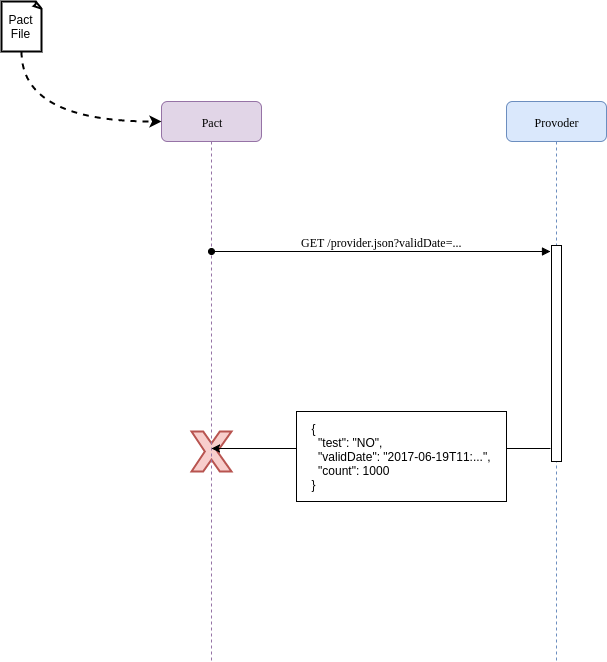

# Example JVM project for the Pact workshop

This project has 3 components, a consumer project and two service providers, one Dropwizard and one
Springboot service that the consumer will interaction with.

## Step 1 - Simple Consumer calling Provider

Given we have a client that needs to make a HTTP GET request to a provider service, and requires a response in JSON format.


The client is quite simple and looks like this

*consumer/src/main/java/au/com/dius/pactworkshop/consumer/Client.java:*

```java
public class Client {
  public Object loadProviderJson() throws UnirestException {
    return Unirest.get("http://localhost:8080/provider.json")
      .queryString("validDate", LocalDateTime.now().toString())
      .asJson().getBody();
  }
}
```

and the dropwizard provider resource

*providers/dropwizard-provider/src/main/java/au/com/dius/pactworkshop/dropwizardprovider/RootResource.java:*

```java
@Path("/provider.json")
@Produces(MediaType.APPLICATION_JSON)
public class RootResource {

  @GET
  public Map<String, Object> providerJson(@QueryParam("validDate") Optional<String> validDate) {
    LocalDateTime valid_time = LocalDateTime.parse(validDate.get());
    Map<String, Object> result = new HashMap<>();
    result.put("test", "NO");
    result.put("validDate", LocalDateTime.now().toString());
    result.put("count", 1000);
    return result;
  }

}
```

The springboot provider controller is similar

*providers/springboot-provider/src/main/java/au/com/dius/pactworkshop/springbootprovider/RootController.java:*

```java
@RestController
public class RootController {

  @RequestMapping("/provider.json")
  public Map<String, Serializable> providerJson(@RequestParam(required = false) String validDate) {
    LocalDateTime validTime = LocalDateTime.parse(validDate);
    Map<String, Serializable> map = new HashMap<>(3);
    map.put("test", "NO");
    map.put("validDate", LocalDateTime.now().toString());
    map.put("count", 1000);
    return map;
  }

}
```

This providers expects a `validDate` parameter in HTTP date format, and then return some simple json back.


Running the client with either provider works nicely. For example, start the dropwizard-provider in one terminal:

```console
$ ./gradlew :providers:dropwizard-provider:run
```

_NOTE_: this task won't complete, it will get to 75% and remain that way until you shutdown the process: `<=========----> 75% EXECUTING [59s]`)

(to start the Spring boot provider instead, you would run `./gradlew :providers:springboot-provider:bootRun`).

Once the provider has successfully initialized, open another terminal session and run the consumer:

```console
$ ./gradlew :consumer:run

> Task :consumer:run
{"test":"NO","validDate":"2018-04-10T10:59:41.122","count":1000}


BUILD SUCCESSFUL in 1s
2 actionable tasks: 2 executed

```

Don't forget to stop the dropwizard-provider that is running in the first terminal when you have finished this step.

## Step 2 - Client Tested but integration fails

Now lets get the client to use the data it gets back from the provider. Here is the updated client method that uses the returned data:

*consumer/src/main/java/au/com/dius/pactworkshop/consumer/Client.java:*

```java
  public List<Object> fetchAndProcessData() throws UnirestException {
      JsonNode data = loadProviderJson();
      System.out.println("data=" + data);

      JSONObject jsonObject = data.getObject();
      int value = 100 / jsonObject.getInt("count");
      ZonedDateTime date = ZonedDateTime.parse(jsonObject.getString("date"));

      System.out.println("value=" + value);
      System.out.println("date=" + date);
      return Arrays.asList(value, date);
  }
```


Let's now test our updated client. We're using [Wiremock](http://wiremock.org/) here to mock out the provider.

*consumer/src/test/java/au/com/dius/pactworkshop/consumer/ClientTest.java:*

```java
public class ClientTest {

  @Rule
  public WireMockRule wireMockRule = new WireMockRule(8080);

  @Test
  public void canProcessTheJsonPayloadFromTheProvider() throws UnirestException {

    String date = "2013-08-16T15:31:20+10:00";

    stubFor(get(urlPathEqualTo("/provider.json"))
      .withQueryParam("validDate", matching(".+"))
      .willReturn(aResponse()
        .withStatus(200)
        .withHeader("Content-Type", "application/json")
        .withBody("{\"test\": \"NO\", \"date\": \"" + date + "\", \"count\": 100}")));

    List<Object> data = new Client().fetchAndProcessData();

    assertThat(data, hasSize(2));
    assertThat(data.get(0), is(1));
    assertThat(data.get(1), is(ZonedDateTime.parse(date)));
  }

}
```


Let's run this spec and see it all pass:

```console
$ ./gradlew :consumer:check

BUILD SUCCESSFUL in 0s
3 actionable tasks: 3 up-to-date
```

However, there is a problem with this integration point. Running the actual client against any of the providers results in
 a runtime exception!

```console
$ ./gradlew :consumer:run

> Task :consumer:run FAILED
data={"test":"NO","validDate":"2018-04-10T11:48:36.838","count":1000}
Exception in thread "main" org.json.JSONException: JSONObject["date"] not found.
        at org.json.JSONObject.get(JSONObject.java:471)
        at org.json.JSONObject.getString(JSONObject.java:717)
        at au.com.dius.pactworkshop.consumer.Client.fetchAndProcessData(Client.java:26)
        at au.com.dius.pactworkshop.consumer.Consumer.main(Consumer.java:7)


FAILURE: Build failed with an exception.

* What went wrong:
Execution failed for task ':consumer:run'.
> Process 'command '/usr/lib/jvm/java-8-oracle/bin/java'' finished with non-zero exit value 1

* Try:
Run with --stacktrace option to get the stack trace. Run with --info or --debug option to get more log output. Run with --scan to get full insights.

* Get more help at https://help.gradle.org

BUILD FAILED in 1s
2 actionable tasks: 1 executed, 1 up-to-date
```

The provider returns a `validDate` while the consumer is trying to use `date`, which will blow up when run for
real even with the tests all passing. Here is where Pact comes in.

## Step 3 - Pact to the rescue

Let us add Pact to the project and write a consumer pact test.

*consumer/src/test/java/au/com/dius/pactworkshop/consumer/ClientPactTest.java*

```java
public class ClientPactTest {

  // This sets up a mock server that pretends to be our provider
  @Rule
  public PactProviderRule provider = new PactProviderRule("Our Provider", "localhost", 1234, this);

  private LocalDateTime dateTime;
  private String dateResult;

  // This defines the expected interaction for out test
  @Pact(provider = "Our Provider", consumer = "Our Little Consumer")
  public RequestResponsePact pact(PactDslWithProvider builder) {
    dateTime = LocalDateTime.now();
    dateResult = "2013-08-16T15:31:20+10:00";
    return builder
      .given("data count > 0")
      .uponReceiving("a request for json data")
      .path("/provider.json")
      .method("GET")
      .query("validDate=" + dateTime.toString())
      .willRespondWith()
      .status(200)
      .body(
          new PactDslJsonBody()
              .stringValue("test", "NO")
              .stringValue("date", dateResult)
              .numberValue("count", 100)
      )
      .toPact();
  }

  @Test
  @PactVerification("Our Provider")
  public void pactWithOurProvider() throws UnirestException {
    // Set up our HTTP client class
    Client client = new Client(provider.getUrl());

    // Invoke out client
    List<Object> result = client.fetchAndProcessData(dateTime);

    assertThat(result, hasSize(2));
    assertThat(result.get(0), is(1));
    assertThat(result.get(1), is(ZonedDateTime.parse(dateResult)));
  }
}
```


This test starts a mock server on a random port that pretends to be our provider. To get this to work we needed to update
our consumer to pass in the URL of the provider. We also updated the `fetchAndProcessData` method to pass in the
query parameter.

Running this spec still passes, but it creates a pact file which we can use to validate our assumptions on the provider side.

```console
$ ./gradlew :consumer:check
Starting a Gradle Daemon, 1 incompatible and 3 stopped Daemons could not be reused, use --status for details

BUILD SUCCESSFUL in 8s
4 actionable tasks: 1 executed, 3 up-to-date
```

Generated pact file (*consumer/build/pacts/Our Little Consumer-Our Provider.json*):

```json
{
  "provider": {
    "name": "Our Provider"
  },
  "consumer": {
    "name": "Our Little Consumer"
  },
  "interactions": [
    {
      "description": "a request for json data",
      "request": {
        "method": "GET",
        "path": "/provider.json",
        "query": {
          "validDate": [
            "2020-06-16T11:49:49.485"
          ]
        }
      },
      "response": {
        "status": 200,
        "headers": {
          "Content-Type": "application/json; charset=UTF-8"
        },
        "body": {
          "date": "2013-08-16T15:31:20+10:00",
          "test": "NO",
          "count": 100
        },
        "matchingRules": {
          "header": {
            "Content-Type": {
              "matchers": [
                {
                  "match": "regex",
                  "regex": "application/json(;\\s?charset=[\\w\\-]+)?"
                }
              ],
              "combine": "AND"
            }
          }
        }
      },
      "providerStates": [
        {
          "name": "data count > 0"
        }
      ]
    }
  ],
  "metadata": {
    "pactSpecification": {
      "version": "3.0.0"
    },
    "pact-jvm": {
      "version": "4.1.2"
    }
  }
}
```

## Step 4 - Verify pact against provider

There are two ways of validating a pact file against a provider. The first is using a build tool (like Gradle) to
execute the pact against the running service. The second is to write a pact verification test. We will be doing both
in this step.

First, we need to **publish** the pact file from the consumer project. For this workshop, we have a `publishWorkshopPact` task in the
main project to do this.

```console
$ ./gradlew publishWorkshopPact

BUILD SUCCESSFUL in 0s
2 actionable tasks: 2 up-to-dat
```

The Pact file from the consumer project will now exist in the build directory of the two provider projects.




### Verifying the springboot provider

For the springboot provider, we are going to use Gradle to verify the pact file for us. We need to add the pact gradle
plugin and the spawn plugin to the project and configure them.

**NOTE: This will not work on Windows, as the Gradle spawn plugin will not work with Windows.**

*providers/springboot-provider/build.gradle:*

```groovy
plugins {
  id "au.com.dius.pact" version "4.1.7"
  id "com.wiredforcode.spawn" version "0.8.2"
}
```

```groovy
task startProvider(type: SpawnProcessTask, dependsOn: 'assemble') {
  command "java -jar ${jar.archivePath}"
  ready 'Started MainApplication'
}

task stopProvider(type: KillProcessTask) {

}

pact {
  serviceProviders {
    'Our_Provider' {
      port = 8080

      startProviderTask = startProvider
      terminateProviderTask = stopProvider

      hasPactWith('Our Little Consumer') {
        pactFile = file("$buildDir/pacts/Our Little Consumer-Our Provider.json")
      }
    }
  }
}
```

Now if we copy the pact file from the consumer project and run our pact verification task, it should fail.

```console
$ ./gradlew :providers:springboot-provider:pactVerify

> Task :providers:springboot-provider:startProvider

  .   ____          _            __ _ _
 /\\ / ___'_ __ _ _(_)_ __  __ _ \ \ \ \
( ( )\___ | '_ | '_| | '_ \/ _` | \ \ \ \
 \\/  ___)| |_)| | | | | || (_| |  ) ) ) )
  '  |____| .__|_| |_|_| |_\__, | / / / /
 =========|_|==============|___/=/_/_/_/
 :: Spring Boot ::        (v2.0.0.RELEASE)
```

... omitting lots of logs ...

```console
2018-04-10 13:55:19.709  INFO 7912 --- [           main] a.c.d.p.s.MainApplication                : Started MainApplication in 3.311 seconds (JVM running for 3.774)
java -jar /home/ronald/Development/Projects/Pact/pact-workshop-jvm/providers/springboot-provider/build/libs/springboot-provider.jar is ready.

> Task :providers:springboot-provider:pactVerify_Our_Provider FAILED

Verifying a pact between Our Little Consumer and Our_Provider
  [Using File /home/ronald/Development/Projects/Pact/pact-workshop-jvm/providers/springboot-provider/build/pacts/Our Little Consumer-Our Provider.json]
  Given data count > 0
         WARNING: State Change ignored as there is no stateChange URL
  a request for json data
    returns a response which
      has status code 200 (OK)
      has a matching body (FAILED)

NOTE: Skipping publishing of verification results as it has been disabled (pact.verifier.publishResults is not 'true')


Failures:

1) Verifying a pact between Our Little Consumer and Our_Provider - a request for json data Given data count > 0

    1.1) BodyMismatch: $ BodyMismatch: Expected date='2013-08-16T15:31:20+10:00' but was missing

        {
        -  "date": "2013-08-16T15:31:20+10:00",
          "test": "NO",
        -  "count": 100
        +  "count": 1000,
        +  "validDate": "2020-06-16T12:08:04.314696"
        }


    1.2) BodyMismatch: $.count BodyMismatch: Expected 100 (Integer) but received 1000 (Integer)


FAILURE: Build failed with an exception.

* What went wrong:
There were 2 non-pending pact failures for provider Our_Provider

* Try:
Run with --stacktrace option to get the stack trace. Run with --info or --debug option to get more log output. Run with --scan to get full insights.

* Get more help at https://help.gradle.org

BUILD FAILED in 6s
5 actionable tasks: 5 executed
```

The test has failed for 2 reasons. Firstly, the count field has a different value to what was expected by the consumer.
Secondly, and more importantly, the consumer was expecting a `date` field while the provider generates a `validDate`
field. Also, the date formats are different.

## Step 5 - Verify the provider with a test

In this step we will verify the same pact file against the Dropwizard provider using a JUnit test. If you need to, 
re-run the `publishWorkshopPact` to get the pact file in the provider project.

We add the pact provider junit jar and the dropwizard testing jar to our project dependencies, and then we can create a
simple test to verify our provider.

```java
@RunWith(PactRunner.class)
@Provider("Our Provider")
@PactFolder("build/pacts")
public class PactVerificationTest {
  @ClassRule
  public static final DropwizardAppRule<ServiceConfig> RULE = new DropwizardAppRule<ServiceConfig>(MainApplication.class,
    ResourceHelpers.resourceFilePath("main-app-config.yaml"));

  @TestTarget
  public final Target target = new HttpTarget(8080);

  @State("data count > 0")
  public void dataCountGreaterThanZero() {

  }
}
```

This test will start the dropwizard app (using the class rule), and then execute the pact requests (defined by the
`@PactFolder` annotation) against the test target.

Running this test will fail for the same reasons as in step 4.

```console
$ ./gradlew :providers:dropwizard-provider:test
Starting a Gradle Daemon, 1 incompatible and 2 stopped Daemons could not be reused, use --status for details

> Task :providers:dropwizard-provider:test 

au.com.dius.pactworkshop.dropwizardprovider.PactVerificationTest > Our Little Consumer - a request for json data FAILED
    java.lang.AssertionError

1 test completed, 1 failed


FAILURE: Build failed with an exception.

* What went wrong:
Execution failed for task ':providers:dropwizard-provider:test'.
> There were failing tests. See the report at: file:///home/ronald/Development/Projects/Pact/pact-workshop-jvm/providers/dropwizard-provider/build/reports/tests/test/index.html

* Try:
Run with --stacktrace option to get the stack trace. Run with --info or --debug option to get more log output. Run with --scan to get full insights.

* Get more help at https://help.gradle.org

BUILD FAILED in 12s
4 actionable tasks: 4 executed
```

The JUnit build report has the expected failures.

```
java.lang.AssertionError: 
Failures:

1) a request for json data

    1.1) BodyMismatch: $ BodyMismatch: Expected date='2013-08-16T15:31:20+10:00' but was missing

        {
        -  "date": "2013-08-16T15:31:20+10:00",
          "test": "NO",
        -  "count": 100
        +  "count": 1000,
        +  "validDate": "2020-06-16T12:29:52.836"
        }


    1.2) BodyMismatch: $.count BodyMismatch: Expected 100 (Integer) but received 1000 (Integer)
```
