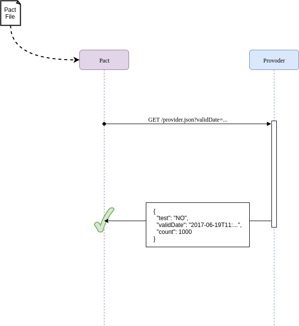
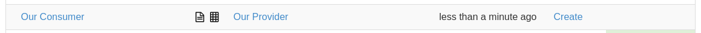

# Example JVM project for the Pact workshop

This workshop is setup with a number of steps that can be run through. Each step is in a branch, so to run through a
step of the workshop just check out the branch for that step (i.e. `git checkout step1`).

This project has 3 components, a consumer project and two service providers, one Dropwizard and one
Springboot service that the consumer will interaction with.

## Step 1 - Simple Consumer calling Provider

Given we have a client that needs to make a HTTP GET request to a provider service, and requires a response in JSON format.


The client is quite simple and looks like this

*consumer/src/main/java/au/com/dius/pactworkshop/consumer/Client.java:*

```java
public class Client {
  public Object loadProviderJson() throws UnirestException {
    return Unirest.get("http://localhost:8080/provider.json")
      .queryString("validDate", LocalDateTime.now().toString())
      .asJson().getBody();
  }
}
```

and the dropwizard provider resource

*providers/dropwizard-provider/src/main/java/au/com/dius/pactworkshop/dropwizardprovider/RootResource.java:*

```java
@Path("/provider.json")
@Produces(MediaType.APPLICATION_JSON)
public class RootResource {

  @GET
  public Map<String, Object> providerJson(@QueryParam("validDate") Optional<String> validDate) {
    LocalDateTime valid_time = LocalDateTime.parse(validDate.get());
    Map<String, Object> result = new HashMap<>();
    result.put("test", "NO");
    result.put("validDate", LocalDateTime.now().toString());
    result.put("count", 1000);
    return result;
  }

}
```

The springboot provider controller is similar

*providers/springboot-provider/src/main/java/au/com/dius/pactworkshop/springbootprovider/RootController.java:*

```java
@RestController
public class RootController {

  @RequestMapping("/provider.json")
  public Map<String, Serializable> providerJson(@RequestParam(required = false) String validDate) {
    LocalDateTime validTime = LocalDateTime.parse(validDate);
    Map<String, Serializable> map = new HashMap<>(3);
    map.put("test", "NO");
    map.put("validDate", LocalDateTime.now().toString());
    map.put("count", 1000);
    return map;
  }

}
```

This providers expects a `validDate` parameter in HTTP date format, and then return some simple json back.


Running the client with either provider works nicely. For example, start the dropwizard-provider in one terminal:

```console
$ ./gradlew :providers:dropwizard-provider:run
```

Once the provider has successfully initialized, open another terminal session and run the consumer:

```console

$ ./gradlew :consumer:run

> Task :consumer:run
{"test":"NO","validDate":"2018-04-10T10:59:41.122","count":1000}


BUILD SUCCESSFUL in 1s
2 actionable tasks: 2 executed

```

Don't forget to stop the dropwizard-provider that is running in the first terminal when you have finished this step.

Don't forget to stop the dropwizard-provider that is running in the first terminal when you have finished this step.

## Step 2 - Client Tested but integration fails

Now lets get the client to use the data it gets back from the provider. Here is the updated client method that uses the returned data:

*consumer/src/main/java/au/com/dius/pactworkshop/consumer/Client.java:*

```java
  public List<Object> fetchAndProcessData() throws UnirestException {
      JsonNode data = loadProviderJson();
      System.out.println("data=" + data);

      JSONObject jsonObject = data.getObject();
      int value = 100 / jsonObject.getInt("count");
      ZonedDateTime date = ZonedDateTime.parse(jsonObject.getString("date"));

      System.out.println("value=" + value);
      System.out.println("date=" + date);
      return Arrays.asList(value, date);
  }
```


Let's now test our updated client. We're using [Wiremock](http://wiremock.org/) here to mock out the provider.

*consumer/src/test/java/au/com/dius/pactworkshop/consumer/ClientTest.java:*

```java
public class ClientTest {

  @Rule
  public WireMockRule wireMockRule = new WireMockRule(8080);

  @Test
  public void canProcessTheJsonPayloadFromTheProvider() throws UnirestException {

    String date = "2013-08-16T15:31:20+10:00";

    stubFor(get(urlPathEqualTo("/provider.json"))
      .withQueryParam("validDate", matching(".+"))
      .willReturn(aResponse()
        .withStatus(200)
        .withHeader("Content-Type", "application/json")
        .withBody("{\"test\": \"NO\", \"date\": \"" + date + "\", \"count\": 100}")));

    List<Object> data = new Client().fetchAndProcessData();

    assertThat(data, hasSize(2));
    assertThat(data.get(0), is(1));
    assertThat(data.get(1), is(ZonedDateTime.parse(date)));
  }

}
```


Let's run this spec and see it all pass:

```console
$ ./gradlew :consumer:check

BUILD SUCCESSFUL in 0s
3 actionable tasks: 3 up-to-date
```

However, there is a problem with this integration point. Running the actual client against any of the providers results in
 a runtime exception!

```console
$ ./gradlew :consumer:run

> Task :consumer:run FAILED
data={"test":"NO","validDate":"2018-04-10T11:48:36.838","count":1000}
Exception in thread "main" org.json.JSONException: JSONObject["date"] not found.
        at org.json.JSONObject.get(JSONObject.java:471)
        at org.json.JSONObject.getString(JSONObject.java:717)
        at au.com.dius.pactworkshop.consumer.Client.fetchAndProcessData(Client.java:26)
        at au.com.dius.pactworkshop.consumer.Consumer.main(Consumer.java:7)


FAILURE: Build failed with an exception.

* What went wrong:
Execution failed for task ':consumer:run'.
> Process 'command '/usr/lib/jvm/java-8-oracle/bin/java'' finished with non-zero exit value 1

* Try:
Run with --stacktrace option to get the stack trace. Run with --info or --debug option to get more log output. Run with --scan to get full insights.

* Get more help at https://help.gradle.org

BUILD FAILED in 1s
2 actionable tasks: 1 executed, 1 up-to-date
```

The provider returns a `validDate` while the consumer is trying to use `date`, which will blow up when run for
real even with the tests all passing. Here is where Pact comes in.

## Step 3 - Pact to the rescue

Let us add Pact to the project and write a consumer pact test.

*consumer/src/test/groovy/au/com/dius/pactworkshop/consumer/ClientPactSpec.groovy*

```groovy
class ClientPactSpec extends Specification {

  private Client client
  private LocalDateTime date
  private PactBuilder provider

  def setup() {
    client = new Client('http://localhost:1234')
    date = LocalDateTime.now()
    provider = new PactBuilder()
    provider {
      serviceConsumer 'Our Little Consumer'
      hasPactWith 'Our Provider'
      port 1234
    }
  }

  def 'Pact with our provider'() {
    given:
    def json = [
      test: 'NO',
      date: '2013-08-16T15:31:20+10:00',
      count: 100
    ]
    provider {
      given('data count > 0')
      uponReceiving('a request for json data')
      withAttributes(path: '/provider.json', query: [validDate: date.toString()])
      willRespondWith(status: 200, body: JsonOutput.toJson(json), headers: ['Content-Type': 'application/json'])
    }

    when:
    def result
    PactVerificationResult pactResult = provider.runTest {
      result = client.fetchAndProcessData(date)
    }

    then:
    pactResult == PactVerificationResult.Ok.INSTANCE
    result == [1, ZonedDateTime.parse(json.date)]
  }

}
```


This test starts a mock server on port 1234 that pretends to be our provider. To get this to work we needed to update
our consumer to pass in the URL of the provider. We also updated the `fetchAndProcessData` method to pass in the
query parameter.

Running this spec still passes, but it creates a pact file which we can use to validate our assumptions on the provider side.

```console
$ ./gradlew :consumer:check
Starting a Gradle Daemon, 1 incompatible and 3 stopped Daemons could not be reused, use --status for details

BUILD SUCCESSFUL in 8s
4 actionable tasks: 1 executed, 3 up-to-date
```

Generated pact file (*consumer/build/pacts/Our Little Consumer-Our Provider.json*):

```json
{
    "provider": {
        "name": "Our Provider"
    },
    "consumer": {
        "name": "Our Little Consumer"
    },
    "interactions": [
        {
            "description": "a request for json data",
            "request": {
                "method": "GET",
                "path": "/provider.json",
                "query": {
                    "validDate": [
                        "2018-04-10T12:34:28.839"
                    ]
                }
            },
            "response": {
                "status": 200,
                "headers": {
                    "Content-Type": "application/json"
                },
                "body": {
                    "test": "NO",
                    "date": "2013-08-16T15:31:20+10:00",
                    "count": 100
                }
            },
            "providerStates": [
                {
                    "name": "data count > 0"
                }
            ]
        }
    ],
    "metadata": {
        "pact-specification": {
            "version": "3.0.0"
        },
        "pact-jvm": {
            "version": "3.5.14"
        }
    }
}
```

## Step 4 - Verify pact against provider

There are two ways of validating a pact file against a provider. The first is using a build tool (like Gradle) to
execute the pact against the running service. The second is to write a pact verification test. We will be doing both
in this step.

First, we need to **publish** the pact file from the consumer project. For this workshop, we have a `publishWorkshopPact` task in the
main project to do this.

```console
$ ./gradlew publishWorkshopPact

BUILD SUCCESSFUL in 0s
2 actionable tasks: 2 up-to-dat
```

The Pact file from the consumer project will now exist in the build directory of the two provider projects.


### Verifying the springboot provider

For the springboot provider, we are going to use Gradle to verify the pact file for us. We need to add the pact gradle
plugin and the spawn plugin to the project and configure them.

**NOTE: This will not work on Windows, as the Gradle spawn plugin will not work with Windows.**

*providers/springboot-provider/build.gradle:*

```groovy
plugins {
  id "au.com.dius.pact" version "3.5.14"
  id "com.wiredforcode.spawn" version "0.8.2"
}
```

```groovy
task startProvider(type: SpawnProcessTask, dependsOn: 'assemble') {
  command "java -jar ${jar.archivePath}"
  ready 'Started MainApplication'
}

task stopProvider(type: KillProcessTask) {

}

pact {
  serviceProviders {
    'Our_Provider' {
      port = 8080

      startProviderTask = startProvider
      terminateProviderTask = stopProvider

      hasPactWith('Our Little Consumer') {
        pactFile = file("$buildDir/pacts/Our Little Consumer-Our Provider.json")
      }
    }
  }
}
```

Now if we copy the pact file from the consumer project and run our pact verification task, it should fail.

```console
$ ./gradlew :providers:springboot-provider:pactVerify

> Task :providers:springboot-provider:startProvider

  .   ____          _            __ _ _
 /\\ / ___'_ __ _ _(_)_ __  __ _ \ \ \ \
( ( )\___ | '_ | '_| | '_ \/ _` | \ \ \ \
 \\/  ___)| |_)| | | | | || (_| |  ) ) ) )
  '  |____| .__|_| |_|_| |_\__, | / / / /
 =========|_|==============|___/=/_/_/_/
 :: Spring Boot ::        (v2.0.0.RELEASE)
```

... omitting lots of logs ...

```console
2018-04-10 13:55:19.709  INFO 7912 --- [           main] a.c.d.p.s.MainApplication                : Started MainApplication in 3.311 seconds (JVM running for 3.774)
java -jar /home/ronald/Development/Projects/Pact/pact-workshop-jvm/providers/springboot-provider/build/libs/springboot-provider.jar is ready.

> Task :providers:springboot-provider:pactVerify_Our_Provider FAILED

Verifying a pact between Our Little Consumer and Our_Provider
  [Using File /home/ronald/Development/Projects/Pact/pact-workshop-jvm/providers/springboot-provider/build/pacts/Our Little Consumer-Our Provider.json]
  Given data count > 0
         WARNING: State Change ignored as there is no stateChange URL
  a request for json data
    returns a response which
      has status code 200 (OK)
      includes headers
        "Content-Type" with value "application/json" (OK)
      has a matching body (FAILED)

Failures:

0) Verifying a pact between Our Little Consumer and Our_Provider - a request for json dataVerifying a pact between Our Little Consumer and Our_Provider - a request for json data Given data count > 0 returns a response which has a matching body
      $ -> Expected date='2013-08-16T15:31:20+10:00' but was missing

        Diff:

            "test": "NO",
        -    "date": "2013-08-16T15:31:20+10:00",
        -    "count": 100
        +    "count": 1000,
        +    "validDate": "2018-04-10T13:55:20.318"
        }

      $.count -> Expected 100 but received 1000


FAILURE: Build failed with an exception.

* What went wrong:
There were 1 pact failures for provider Our_Provider

* Try:
Run with --stacktrace option to get the stack trace. Run with --info or --debug option to get more log output. Run with --scan to get full insights.

* Get more help at https://help.gradle.org

BUILD FAILED in 7s
5 actionable tasks: 5 executed
```

The test has failed for 2 reasons. Firstly, the count field has a different value to what was expected by the consumer.
Secondly, and more importantly, the consumer was expecting a `date` field while the provider generates a `validDate`
field. Also, the date formats are different.

## Step 5 - Verify the provider with a test

In this step we will verify the same pact file against the Dropwizard provider using a JUnit test. If you need to,
re-run the `publishWorkshopPact` to get the pact file in the provider project.

We add the pact provider junit jar and the dropwizard testing jar to our project dependencies, and then we can create a
simple test to verify our provider.

```java
@RunWith(PactRunner.class)
@Provider("Our Provider")
@PactFolder("build/pacts")
public class PactVerificationTest {
  @ClassRule
  public static final DropwizardAppRule<ServiceConfig> RULE = new DropwizardAppRule<ServiceConfig>(MainApplication.class,
    ResourceHelpers.resourceFilePath("main-app-config.yaml"));

  @TestTarget
  public final Target target = new HttpTarget(8080);

  @State("data count > 0")
  public void dataCountGreaterThanZero() {

  }
}
```

This test will start the dropwizard app (using the class rule), and then execute the pact requests (defined by the
`@PactFolder` annotation) against the test target.

Running this test will fail for the same reasons as in step 4.

```console
$ ./gradlew :providers:dropwizard-provider:test
Starting a Gradle Daemon, 1 incompatible and 2 stopped Daemons could not be reused, use --status for details

> Task :providers:dropwizard-provider:test

au.com.dius.pactworkshop.dropwizardprovider.PactVerificationTest > Our Little Consumer - a request for json data FAILED
    java.lang.AssertionError

1 test completed, 1 failed


FAILURE: Build failed with an exception.

* What went wrong:
Execution failed for task ':providers:dropwizard-provider:test'.
> There were failing tests. See the report at: file:///home/ronald/Development/Projects/Pact/pact-workshop-jvm/providers/dropwizard-provider/build/reports/tests/test/index.html

* Try:
Run with --stacktrace option to get the stack trace. Run with --info or --debug option to get more log output. Run with --scan to get full insights.

* Get more help at https://help.gradle.org

BUILD FAILED in 12s
4 actionable tasks: 4 executed
```

The JUnit build report has the expected failures (standard output shown here).

```
Verifying a pact between Our Little Consumer and Our Provider
  Given data count > 0
  a request for json data
    returns a response which
      has status code 200 (OK)
      includes headers
        "Content-Type" with value "application/json" (OK)
      has a matching body (FAILED)

Failures:

0) a request for json data returns a response which has a matching body
      $ -> Expected date='2013-08-16T15:31:20+10:00' but was missing

        Diff:

            "test": "NO",
        -    "date": "2013-08-16T15:31:20+10:00",
        -    "count": 100
        +    "count": 1000,
        +    "validDate": "2018-04-10T14:15:04.902"
        }

      $.count -> Expected 100 but received 1000

```

## Step 6 - Back to the client we go

Let's correct the consumer test to handle any integer for `count` and use the correct field for the `date`. Then we need
to add a type matcher for `count` and change the field for the date to be `validDate`. We can also add a date expression
to make sure the `validDate` field is a valid date. This is important because we are parsing it.

The updated consumer test is now:

```groovy
    provider {
      given('data count > 0')
      uponReceiving('a request for json data')
      withAttributes(path: '/provider.json', query: [validDate: date.toString()])
      willRespondWith(status: 200)
      withBody {
        test 'NO'
        validDate timestamp("yyyy-MM-dd'T'HH:mm:ssXXX", json.date)
        count integer(json.count)
      }
    }
```

Running this test will fail until we fix the client. Here is the correct client function:

```java
  public List<Object> fetchAndProcessData(LocalDateTime dateTime) throws UnirestException {
      JsonNode data = loadProviderJson(dateTime);
      System.out.println("data=" + data);

      JSONObject jsonObject = data.getObject();
      int value = 100 / jsonObject.getInt("count");
      OffsetDateTime date = OffsetDateTime.parse(jsonObject.getString("validDate"),
        DateTimeFormatter.ofPattern("yyyy-MM-dd'T'HH:mm:ssXXX"));

      System.out.println("value=" + value);
      System.out.println("date=" + date);
      return Arrays.asList(value, date);
  }
```

Now the test passes. But we still have a problem with the date format, which we must fix in the provider. Running the
client now fails because of that.

```console
$ ./gradlew consumer:run
Starting a Gradle Daemon, 1 busy and 1 incompatible and 2 stopped Daemons could not be reused, use --status for details

> Task :consumer:run FAILED
data={"test":"NO","validDate":"2018-04-10T14:39:50.419","count":1000}
Exception in thread "main" java.time.format.DateTimeParseException: Text '2018-04-10T14:39:50.419' could not be parsed at index 19
        at java.time.format.DateTimeFormatter.parseResolved0(DateTimeFormatter.java:1949)
        at java.time.format.DateTimeFormatter.parse(DateTimeFormatter.java:1851)
        at java.time.OffsetDateTime.parse(OffsetDateTime.java:402)
        at au.com.dius.pactworkshop.consumer.Client.fetchAndProcessData(Client.java:34)
        at au.com.dius.pactworkshop.consumer.Consumer.main(Consumer.java:9)


FAILURE: Build failed with an exception.

* What went wrong:
Execution failed for task ':consumer:run'.
> Process 'command '/usr/lib/jvm/java-8-oracle/bin/java'' finished with non-zero exit value 1

* Try:
Run with --stacktrace option to get the stack trace. Run with --info or --debug option to get more log output. Run with --scan to get full insights.

* Get more help at https://help.gradle.org

BUILD FAILED in 5s
2 actionable tasks: 1 executed, 1 up-to-date
```

We need to **publish** the consumer pact file to the provider projects again. Then, running the provider verification
tests we get the expected failure about the date format.

```
Failures:

0) Verifying a pact between Our Little Consumer and Our_Provider - a request for json dataVerifying a pact between Our Little Consumer and Our_Provider - a request for json data Given data count > 0 returns a response which has a matching body
      $.validDate -> Expected '2018-04-10T14:49:57.675' to match a timestamp of 'yyyy-MM-dd'T'HH:mm:ssXXX': Unable to parse the date: 2018-04-10T14:49:57.675

```

## Step 7 - Verify the providers again

Lets fix the providers and then re-run the verification tests. Here is the corrected Dropwizard resource:

```java
@RestController
public class RootController {

  @RequestMapping("/provider.json")
  public Map<String, Serializable> providerJson(@RequestParam(required = false) String validDate) {
    LocalDateTime validTime = LocalDateTime.parse(validDate);
    Map<String, Serializable> map = new HashMap<>(3);
    map.put("test", "NO");
    map.put("validDate", OffsetDateTime.now().format(DateTimeFormatter.ofPattern("yyyy-MM-dd'T'HH:mm:ssXXX")));
    map.put("count", 1000);
    return map;
  }

}
```





Running the verification against the providers now pass. Yay!

## Step 8 - Test for the missing query parameter

In this step we are going to add a test for the case where the query parameter is missing or invalid. We do this by 
adding additional tests and expectations to the consumer pact test. Our client code needs to be modified slightly to
be able to pass invalid dates in, and if the date parameter is null, don't include it in the request.

Here are the two additional tests:

*consumer/src/test/groovy/au/com/dius/pactworkshop/consumer/ClientPactSpec.groovy:*

```groovy
  def 'handles a missing date parameter'() {
    given:
    provider {
      given('data count > 0')
      uponReceiving('a request with a missing date parameter')
      withAttributes(path: '/provider.json')
      willRespondWith(status: 400, body: '"validDate is required"', headers: ['Content-Type': 'application/json'])
    }

    when:
    PactVerificationResult pactResult = provider.runTest {
      client.fetchAndProcessData(null)
    }

    then:
    pactResult == PactVerificationResult.Ok.INSTANCE
  }

  def 'handles an invalid date parameter'() {
    given:
    provider {
      given('data count > 0')
      uponReceiving('a request with an invalid date parameter')
      withAttributes(path: '/provider.json', query: [validDate: 'This is not a date'])
      willRespondWith(status: 400, body: $/"'This is not a date' is not a date"/$, headers: ['Content-Type': 'application/json'])
    }

    when:
    def result
    PactVerificationResult pactResult = provider.runTest {
      result = client.fetchAndProcessData('This is not a date')
    }

    then:
    pactResult == PactVerificationResult.Ok.INSTANCE
  }
```

After running our specs, the pact file will have 2 new interactions.

*consumer/build/pacts/Our Little Consumer-Our Provider.json:*

```json
[
  {
      "description": "a request with a missing date parameter",
      "request": {
          "method": "GET",
          "path": "/provider.json"
      },
      "response": {
          "status": 400,
          "headers": {
              "Content-Type": "application/json"
          },
          "body": {
              "error": "validDate is required"
          }
      },
      "providerStates": [
          {
              "name": "data count > 0"
          }
      ]
  },
  {
      "description": "a request with an invalid date parameter",
      "request": {
          "method": "GET",
          "path": "/provider.json",
          "query": {
              "validDate": [
                  "This is not a date"
              ]
          }
      },
      "response": {
          "status": 400,
          "headers": {
              "Content-Type": "application/json"
          },
          "body": {
              "error": "'This is not a date' is not a date"
          }
      },
      "providerStates": [
          {
              "name": "data count > 0"
          }
      ]
  }
]
```

## Step 9 - Verify the provider with the missing/invalid date query parameter
   
Let us run this updated pact file with our providers (use the `publishWorkshopPact` task). We get a 500 response as the provider can't handle the missing
or incorrect date.

Here is the dropwizard test output:

```console
Verifying a pact between Our Little Consumer and Our Provider
  Given data count > 0
  a request with a missing date parameter
    returns a response which
      has status code 400 (FAILED)
      includes headers
        "Content-Type" with value "application/json" (OK)
      has a matching body (FAILED)

Failures:

0) a request with a missing date parameter returns a response which has a matching body
      $ -> Expected error='validDate is required' but was missing

        Diff:

        {
        -    "error": "validDate is required"
        +    "code": 500,
        +    "message": "There was an error processing your request. It has been logged (ID 15c8b3719074eb84)."
        }


1) a request with a missing date parameter returns a response which has status code 400
      assert expectedStatus == actualStatus
             |              |  |
             400            |  500
                            false


```

and the springboot build output:

```console
> Task :providers:springboot-provider:pactVerify_Our_Provider

Verifying a pact between Our Little Consumer and Our_Provider
  [Using File /home/ronald/Development/Projects/Pact/pact-workshop-jvm/providers/springboot-provider/build/pacts/Our Little Consumer-Our Provider.json]
  Given data count > 0
         WARNING: State Change ignored as there is no stateChange URL
  a request for json data
    returns a response which
      has status code 200 (OK)
      includes headers
        "Content-Type" with value "application/json" (OK)
      has a matching body (OK)
  Given data count > 0
         WARNING: State Change ignored as there is no stateChange URL
  a request with a missing date parameter
    returns a response which
      has status code 400 (FAILED)
      includes headers
        "Content-Type" with value "application/json" (OK)
      has a matching body (FAILED)
  Given data count > 0
         WARNING: State Change ignored as there is no stateChange URL
  a request with an invalid date parameter
    returns a response which
      has status code 400 (FAILED)
      includes headers
        "Content-Type" with value "application/json" (OK)
      has a matching body (FAILED)

Failures:

0) Verifying a pact between Our Little Consumer and Our_Provider - a request with a missing date parameterVerifying a pact between Our Little Consumer and Our_Provider - a request with a missing date parameter Given data count > 0 returns a response which has status code 400
      assert expectedStatus == actualStatus
             |              |  |
             400            |  500
                            false

1) Verifying a pact between Our Little Consumer and Our_Provider - a request with a missing date parameterVerifying a pact between Our Little Consumer and Our_Provider - a request with a missing date parameter Given data count > 0 returns a response which has a matching body
      $.error -> Expected 'validDate is required' but received 'Internal Server Error'


2) Verifying a pact between Our Little Consumer and Our_Provider - a request with an invalid date parameterVerifying a pact between Our Little Consumer and Our_Provider - a request with an invalid date parameter Given data count > 0 returns a response which has status code 400
      assert expectedStatus == actualStatus
             |              |  |
             400            |  500
                            false

3) Verifying a pact between Our Little Consumer and Our_Provider - a request with an invalid date parameterVerifying a pact between Our Little Consumer and Our_Provider - a request with an invalid date parameter Given data count > 0 returns a response which has a matching body
      $.error -> Expected ''This is not a date' is not a date' but received 'Internal Server Error'


FAILURE: Build failed with an exception.

* What went wrong:
There were 4 pact failures for provider Our_Provider

* Try:
Run with --stacktrace option to get the stack trace. Run with --info or --debug option to get more log output. Run with --scan to get full insights.

* Get more help at https://help.gradle.org

BUILD FAILED in 8s
5 actionable tasks: 4 executed, 1 up-to-date
```

Time to update the providers to handle these cases.

## Step 10 - Update the providers to handle the missing/invalid query parameters

Let's fix our providers so they generate the correct responses for the query parameters.

### Dropwizard provider

The Dropwizard root resource gets updated to check if the parameter has been passed, and handle the date parse exception
if it is invalid. Two new exceptions get thrown for these cases.

```java
  @GET
  public Map<String, Serializable> providerJson(@QueryParam("validDate") Optional<String> validDate) {
    if (validDate.isPresent()) {
      try {
        LocalDateTime validTime = LocalDateTime.parse(validDate.get());
        Map<String, Serializable> result = new HashMap<>(3);
        result.put("test", "NO");
        result.put("validDate", OffsetDateTime.now().format(DateTimeFormatter.ofPattern("yyyy-MM-dd'T'HH:mm:ssXXX")));
        result.put("count", 1000);
        return result;
      } catch (DateTimeParseException e) {
        throw new InvalidQueryParameterException("'" + validDate.get() + "' is not a date", e);
      }
    } else {
      throw new QueryParameterRequiredException("validDate is required");
    }
  }
```

Next step is to create exception mappers for the new exceptions, and register them with the Dropwizard environment.

```java
public class InvalidQueryParameterExceptionMapper implements ExceptionMapper<InvalidQueryParameterException> {
  @Override
  public Response toResponse(InvalidQueryParameterException exception) {
    return Response.status(Response.Status.BAD_REQUEST)
      .type(MediaType.APPLICATION_JSON_TYPE)
      .entity("{\"error\": \"" + exception.getMessage() + "\"}")
      .build();
  }
}
```

The main provider run method becomes:

```groovy
  void run(ServiceConfig configuration, Environment environment) {
    environment.jersey().register(new InvalidQueryParameterExceptionMapper())
    environment.jersey().register(new QueryParameterRequiredExceptionMapper())
    environment.jersey().register(new RootResource())
  }
```

Now running the `PactVerificationTest` will pass.

### Springboot provider

The Springboot root controller gets updated in a similar way to the Dropwizard resource.

```java
  @RequestMapping("/provider.json")
  public Map<String, Serializable> providerJson(@RequestParam(required = false) String validDate) {
    if (StringUtils.isNotEmpty(validDate)) {
      try {
        LocalDateTime validTime = LocalDateTime.parse(validDate);
        Map<String, Serializable> map = new HashMap<>(3);
        map.put("test", "NO");
        map.put("validDate", OffsetDateTime.now().format(DateTimeFormatter.ofPattern("yyyy-MM-dd'T'HH:mm:ssXXX")));
        map.put("count", 1000);
        return map;
      } catch (DateTimeParseException e) {
        throw new InvalidQueryParameterException("'" + validDate + "' is not a date", e);
      }
    } else {
      throw new QueryParameterRequiredException("validDate is required");
    }
  }
```

Then, to get the exceptions mapped to the correct response, we need to create a controller advice.

```java
@ControllerAdvice(basePackageClasses = RootController.class)
public class RootControllerAdvice extends ResponseEntityExceptionHandler {
  @ExceptionHandler({InvalidQueryParameterException.class, QueryParameterRequiredException.class})
  @ResponseBody
  public ResponseEntity<String> handleControllerException(HttpServletRequest request, Throwable ex) {
    HttpHeaders headers = new HttpHeaders();
    headers.setContentType(MediaType.APPLICATION_JSON);
    return new ResponseEntity<>("{\"error\": \"" + ex.getMessage() + "\"}", headers, HttpStatus.BAD_REQUEST);
  }
}
```

Now running the `pactVerify` is all successful.

## Step 11 - Provider states

We have one final thing to test for. If the provider ever returns a count of zero, we will get a division by
zero error in our client. This is an important bit of information to add to our contract. Let us start with a
consumer test for this.

```groovy
  def 'when there is no data'() {
    given:
    provider {
      given('data count == 0')
      uponReceiving('a request for json data')
      withAttributes(path: '/provider.json', query: [validDate: date.toString()])
      willRespondWith(status: 404)
    }

    when:
    def result
    PactVerificationResult pactResult = provider.runTest {
      result = client.fetchAndProcessData(date.toString())
    }

    then:
    pactResult == PactVerificationResult.Ok.INSTANCE
  }
```

This adds a new interaction to the pact file:

```json

  {
      "description": "a request for json data",
      "request": {
          "method": "GET",
          "path": "/provider.json",
          "query": {
              "validDate": [
                  "2018-04-10T16:12:27.142"
              ]
          }
      },
      "response": {
          "status": 404
      },
      "providerStates": [
          {
              "name": "data count == 0"
          }
      ]
  }

```

## Step 12 - provider states for the providers

To be able to verify our providers, we need to be able to change the data that the provider returns. There are different
ways of doing this depending on how the provider is being verified.


### Dropwizard provider

The dropwizard provider is being verified by a test, so we can setup methods annotated with the state and then modify the
controller appropriately. First, we need some data store that we could manipulate. For out case, we are just going to
use a singleton class, but in a real project you would probably use a database.

```java
public class DataStore {
  public static final DataStore INSTANCE = new DataStore();
  private int dataCount = 1000;

  private DataStore() { }

  public int getDataCount() {
    return dataCount;
  }

  public void setDataCount(int dataCount) {
    this.dataCount = dataCount;
  }
}
```

Next, we update out root resource to use the value from the data store, and throw an exception if there is no data.

```java
  @GET
  public Map<String, Serializable> providerJson(@QueryParam("validDate") Optional<String> validDate) {
    if (validDate.isPresent()) {
      if (DataStore.INSTANCE.getDataCount() > 0) {
        try {
          LocalDateTime validTime = LocalDateTime.parse(validDate.get());
          Map<String, Serializable> result = new HashMap<>(3);
          result.put("test", "NO");
          result.put("validDate", OffsetDateTime.now().format(DateTimeFormatter.ofPattern("yyyy-MM-dd'T'HH:mm:ssXXX")));
          result.put("count", DataStore.INSTANCE.getDataCount());
          return result;
        } catch (DateTimeParseException e) {
          throw new InvalidQueryParameterException("'" + validDate.get() + "' is not a date", e);
        }
      } else {
        throw new NoDataException();
      }
    } else {
      throw new QueryParameterRequiredException("validDate is required");
    }
  }
```

We do the same exception mapping for the new exception as we did before.

```java
public class NoDataExceptionMapper implements ExceptionMapper<NoDataException> {
  @Override
  public Response toResponse(NoDataException exception) {
    return Response.status(Response.Status.NOT_FOUND).build();
  }
}
```

Now we can change the data store value in our test based on the provider state.

```java
  @State("data count > 0")
  public void dataCountGreaterThanZero() {
    DataStore.INSTANCE.setDataCount(1000);
  }

  @State("data count == 0")
  public void dataCountZero() {
    DataStore.INSTANCE.setDataCount(0);
  }
```

Running the test now passes.

### Springboot provider

Our Springboot provider is being verified by the Pact Gradle verification task, which requires the provider to be
running in the background. We can not directly manipulate it. The Gradle task has a state change URL feature that can
help us here. This is basically a special URL that will receive the state that the provider needs to be in.

First, lets enable the state change URL handling in the build gradle file.

```groovy
pact {
  serviceProviders {
    'Our_Provider' {
      port = 8080

      startProviderTask = startProvider
      terminateProviderTask = stopProvider
      stateChangeUrl = url('http://localhost:8080/pactStateChange')

      hasPactWith('Our Little Consumer') {
        pactFile = file("$buildDir/pacts/Our Little Consumer-Our Provider.json")
      }
    }
  }
}
```

Now we create a new controller to handle this. As this controller is only for our test, we make sure it is only available
in the test profile. We also need to make sure the app runs in the test profile by adding a parameter to the start task.

```groovy
task startProvider(type: SpawnProcessTask, dependsOn: 'assemble') {
  command "java -Dspring.profiles.active=test -jar ${jar.archivePath}"
  ready 'Started MainApplication'
}
```

Here is the state change controller:

```java
@RestController
@Profile("test")
public class StateChangeController {
  @RequestMapping(value = "/pactStateChange", method = RequestMethod.POST)
  public void providerState(@RequestBody Map body) {
    if (body.get("state").equals("data count > 0")) {
      DataStore.INSTANCE.setDataCount(1000);
    } else if (body.get("state").equals("data count == 0")) {
      DataStore.INSTANCE.setDataCount(0);
    }
  }
}
```

This controller will change the value of the datastore. We then use the datastore in our normal controller.

```java
  @RequestMapping("/provider.json")
  public Map<String, Serializable> providerJson(@RequestParam(required = false) String validDate) {
    if (StringUtils.isNotEmpty(validDate)) {
      if (DataStore.INSTANCE.getDataCount() > 0) {
        try {
          LocalDateTime validTime = LocalDateTime.parse(validDate);
          Map<String, Serializable> map = new HashMap<>(3);
          map.put("test", "NO");
          map.put("validDate", OffsetDateTime.now().format(DateTimeFormatter.ofPattern("yyyy-MM-dd'T'HH:mm:ssXXX")));
          map.put("count", DataStore.INSTANCE.getDataCount());
          return map;
        } catch (DateTimeParseException e) {
          throw new InvalidQueryParameterException("'" + validDate + "' is not a date", e);
        }
      } else {
        throw new NoDataException();
      }
    } else {
      throw new QueryParameterRequiredException("validDate is required");
    }
  }
```

and update our controller advice to return the 404 response when a `NoDataException` is raised.

```java
@ControllerAdvice(basePackageClasses = RootController.class)
public class RootControllerAdvice extends ResponseEntityExceptionHandler {
  @ExceptionHandler({InvalidQueryParameterException.class, QueryParameterRequiredException.class})
  @ResponseBody
  public ResponseEntity<String> handleControllerException(HttpServletRequest request, Throwable ex) {
    HttpHeaders headers = new HttpHeaders();
    headers.setContentType(MediaType.APPLICATION_JSON);
    return new ResponseEntity<>("{\"error\": \"" + ex.getMessage() + "\"}", headers, HttpStatus.BAD_REQUEST);
  }

  @ExceptionHandler(NoDataException.class)
  @ResponseBody
  ResponseEntity handleNoDataException(HttpServletRequest request, Throwable ex) {
    return new ResponseEntity(HttpStatus.NOT_FOUND);
  }
}
```

Running the Gradle pact verification now passes.

# Step 13 - Using a Pact Broker

We've been publishing our pacts from the consumer project by coping the files over to the provider project, but we can
use a Pact Broker to do this instead.

### Consumer

First, in the consumer project we need to add the Gradle Pact plugin and tell it about our broker.

```groovy
plugins {
  id "au.com.dius.pact" version "3.5.14"
}

... omitted ...

pact {
  publish {
    pactBrokerUrl = 'https://test.pact.dius.com.au'
    pactBrokerUsername = project.pactBrokerUser
    pactBrokerPassword = project.pactBrokerPassword
  }
}

```

Now, we can run `./gradlew consumer:pactPublish` after running the consumer tests to have the generated pact file 
published to the broker. Afterwards, you can navigate to the Pact Broker URL and see the published pact against
the consumer and provider names setup in our consumer test.



### Dropwizard provider

In the `PactVerificationTest` we can change the source we fetch pacts from by using a `@PactBroker` annotation instead
of the `@PactFolder` one. We also need to pass the username and property through to the test.

Updated gradle build file:

```groovy
test {
  systemProperty 'pactBrokerUser', pactBrokerUser
  systemProperty 'pactBrokerPassword', pactBrokerPassword
}
```

Updated test:

```java
@RunWith(PactRunner.class)
@Provider("Our Provider")
@PactBroker(host = "test.pact.dius.com.au", protocol = "https", port = "443",
  authentication = @PactBrokerAuth(username = "${pactBrokerUser}", password = "${pactBrokerPassword}"))
public class PactVerificationTest {
  @ClassRule
  public static final DropwizardAppRule<ServiceConfig> RULE = new DropwizardAppRule<ServiceConfig>(MainApplication.class,
    ResourceHelpers.resourceFilePath("main-app-config.yaml"));

  @TestTarget
  public final Target target = new HttpTarget(8080);

  @State("data count > 0")
  public void dataCountGreaterThanZero() {
    DataStore.INSTANCE.setDataCount(1000);
  }

  @State("data count == 0")
  public void dataCountZero() {
    DataStore.INSTANCE.setDataCount(0);
  }
}
```

### Springboot provider

The springboot provider is using the Gradle plugin, so we can just configure its build to fetch the pacts from the 
broker.

Updated build file:

```groovy
pact {
  serviceProviders {
    'Our_Provider' {
      port = 8080

      startProviderTask = startProvider
      terminateProviderTask = stopProvider
      stateChangeUrl = url('http://localhost:8080/pactStateChange')

      hasPactsFromPactBroker("https://test.pact.dius.com.au", authentication: ['Basic', pactBrokerUser, pactBrokerPassword])
    }
  }
}
```

Running either of the verification tests will now publish the result back to the broker. If you refresh the index page in the broker,
you will see the pacts marked as verified.


