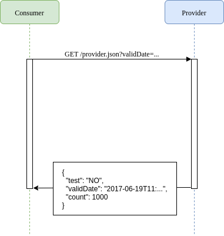
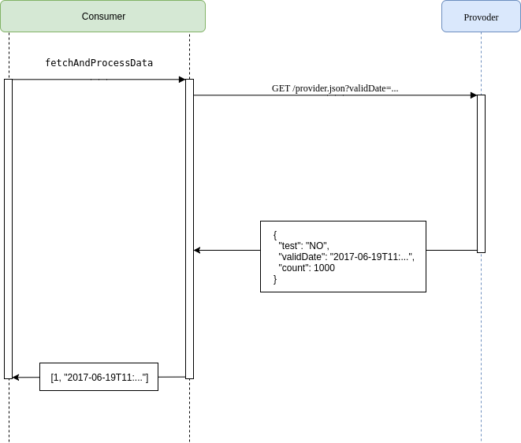
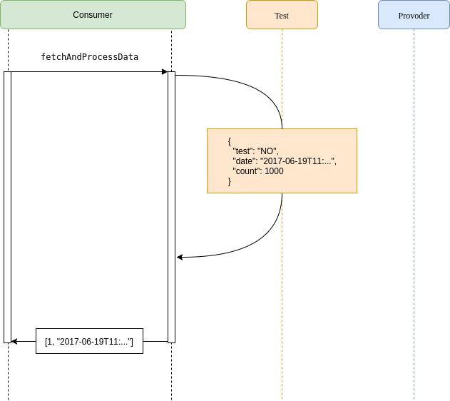
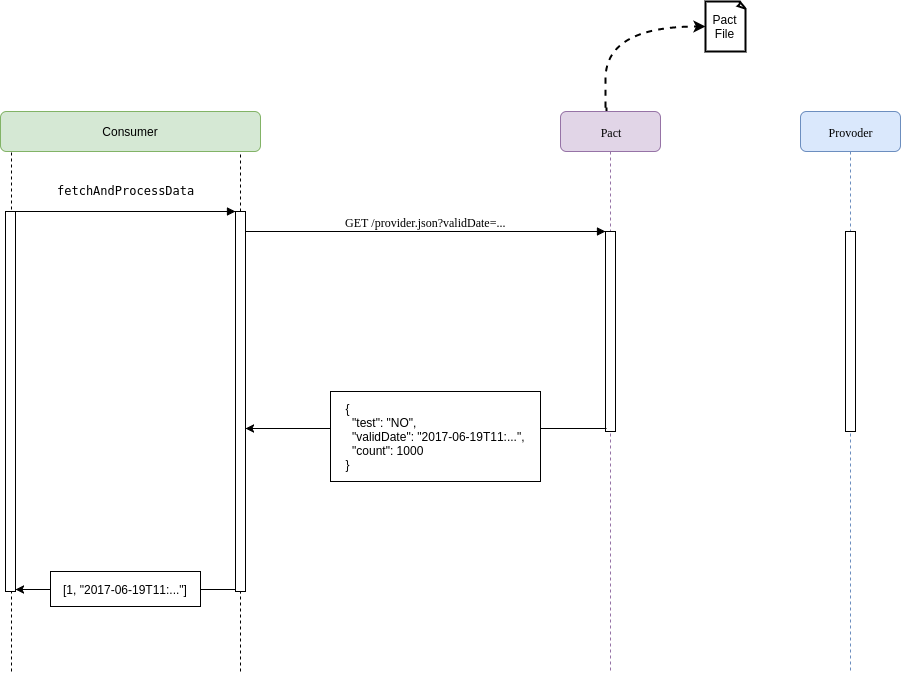

# Example JVM project for the Pact workshop

This project has 3 components, a consumer project and two service providers, one Dropwizard and one
Springboot service that the consumer will interaction with.

## Step 1 - Simple Consumer calling Provider

Given we have a client that needs to make a HTTP GET request to a provider service, and requires a response in JSON format.


The client is quite simple and looks like this

*consumer/src/main/groovy/au/com/dius/pactworkshop/consumer/Client.groovy:*

```groovy
class Client {

  def loadProviderJson() {
    def http = new RESTClient('http://localhost:8080')
    def response = http.get(path: '/provider.json', query: [validDate: LocalDateTime.now().toString()])
    if (response.success) {
      response.data
    }
  }
}
```

and the dropwizard provider resource

*providers/dropwizard-provider/src/main/groovy/au/com/dius/pactworkshop/dropwizardprovider/RootResource.groovy:*

```groovy
@Path("/provider.json")
@Produces(MediaType.APPLICATION_JSON)
class RootResource {

  @GET
  Map providerJson(@QueryParam("validDate") Optional<String> validDate) {
    def valid_time = LocalDateTime.parse(validDate.get())
    [
      test: 'NO',
      validDate: LocalDateTime.now().toString(),
      count: 1000
    ]
  }

}
```

The springboot provider controller is similar

*providers/springboot-provider/src/main/groovy/au/com/dius/pactworkshop/springbootprovider/RootController.groovy:*

```groovy
@RestController
class RootController {

  @RequestMapping("/provider.json")
  Map providerJson(@RequestParam(required = false) String validDate) {
    def validTime = LocalDateTime.parse(validDate)
    [
      test: 'NO',
      validDate: LocalDateTime.now().toString(),
      count: 1000
    ]
  }

}
```

This providers expects a `validDate` parameter in HTTP date format, and then return some simple json back.





Running the client with either provider works nicely. For example, start the dropwizard-provider in one terminal:

```console
./gradlew :providers:dropwizard-provider:run
```

Once the provider has successfully initialized, open another terminal session and run the consumer:

```console

$ ./gradlew :consumer:run
Starting a Gradle Daemon, 4 stopped Daemons could not be reused, use --status for details
:consumer:compileJava UP-TO-DATE
:consumer:compileGroovy UP-TO-DATE
:consumer:processResources UP-TO-DATE
:consumer:classes UP-TO-DATE
:consumer:run
[test:NO, validDate:2017-01-27T11:49:04.131, count:1000]

BUILD SUCCESSFUL
```

Don't forget to stop the dropwizard-provider that is running in the first terminal when you have finished this step.

## Step 2 - Client Tested but integration fails

Now lets get the client to use the data it gets back from the provider. Here is the updated client method that uses the returned data:

*consumer/src/main/groovy/au/com/dius/pactworkshop/consumer/Client.groovy:*

```groovy
  def fetchAndProcessData() {
    def data = loadProviderJson()
    println "data=$data"
    def value = 100 / data.count
    def date = LocalDateTime.parse(data.date)
    println "value=$value"
    println "date=$date"
    [value, date]
  }
```



Let's now test our updated client.

*consumer/src/test/groovy/au/com/dius/pactworkshop/consumer/ClientSpec.groovy:*

```groovy
class ClientSpec extends Specification {

  private Client client
  private RESTClient mockHttp

  def setup() {
    mockHttp = Mock(RESTClient)
    client = new Client(http: mockHttp)
  }

  def 'can process the json payload from the provider'() {
    given:
    def json = [
      test: 'NO',
      date: '2013-08-16T15:31:20+10:00',
      count: 100
    ]

    when:
    def result = client.fetchAndProcessData()

    then:
    1 * mockHttp.get(_) >> [data: json, success: true]
    result == [1, ZonedDateTime.parse(json.date)]
  }

}
```



Let's run this spec and see it all pass:

```console
$ ./gradlew :consumer:check
:consumer:compileJava UP-TO-DATE
:consumer:compileGroovy
:consumer:processResources UP-TO-DATE
:consumer:classes
:consumer:compileTestJava UP-TO-DATE
:consumer:compileTestGroovy
:consumer:processTestResources UP-TO-DATE
:consumer:testClasses
:consumer:test
:consumer:check

BUILD SUCCESSFUL
```

However, there is a problem with this integration point. Running the actual client against any of the providers results in
 a runtime exception!

```
$ ./gradlew :consumer:run
:consumer:compileJava UP-TO-DATE
:consumer:compileGroovy UP-TO-DATE
:consumer:processResources UP-TO-DATE
:consumer:classes UP-TO-DATE
:consumer:run
data=[test:NO, validDate:2017-01-27T14:21:23.174, count:1000]
Exception in thread "main" java.lang.NullPointerException: text
        at java.util.Objects.requireNonNull(Objects.java:228)
        at java.time.format.DateTimeFormatter.parse(DateTimeFormatter.java:1848)
        at java.time.ZonedDateTime.parse(ZonedDateTime.java:597)
        at java.time.ZonedDateTime.parse(ZonedDateTime.java:582)
        at java_time_ZonedDateTime$parse.call(Unknown Source)
        at org.codehaus.groovy.runtime.callsite.CallSiteArray.defaultCall(CallSiteArray.java:48)
        at org.codehaus.groovy.runtime.callsite.AbstractCallSite.call(AbstractCallSite.java:113)
        at org.codehaus.groovy.runtime.callsite.AbstractCallSite.call(AbstractCallSite.java:125)
        at au.com.dius.pactworkshop.consumer.Client.fetchAndProcessData(Client.groovy:26)
        at au.com.dius.pactworkshop.consumer.Client$fetchAndProcessData.call(Unknown Source)
        at org.codehaus.groovy.runtime.callsite.CallSiteArray.defaultCall(CallSiteArray.java:48)
        at org.codehaus.groovy.runtime.callsite.AbstractCallSite.call(AbstractCallSite.java:113)
        at org.codehaus.groovy.runtime.callsite.AbstractCallSite.call(AbstractCallSite.java:117)
        at au.com.dius.pactworkshop.consumer.Consumer.run(Consumer.groovy:3)
        at sun.reflect.NativeMethodAccessorImpl.invoke0(Native Method)
        at sun.reflect.NativeMethodAccessorImpl.invoke(NativeMethodAccessorImpl.java:62)
        at sun.reflect.DelegatingMethodAccessorImpl.invoke(DelegatingMethodAccessorImpl.java:43)
        at java.lang.reflect.Method.invoke(Method.java:498)
        at org.codehaus.groovy.reflection.CachedMethod.invoke(CachedMethod.java:93)
        at groovy.lang.MetaMethod.doMethodInvoke(MetaMethod.java:325)
        at groovy.lang.MetaClassImpl.invokeMethod(MetaClassImpl.java:1218)
        at groovy.lang.MetaClassImpl.invokeMethod(MetaClassImpl.java:1027)
        at org.codehaus.groovy.runtime.InvokerHelper.invokePogoMethod(InvokerHelper.java:925)
        at org.codehaus.groovy.runtime.InvokerHelper.invokeMethod(InvokerHelper.java:908)
        at org.codehaus.groovy.runtime.InvokerHelper.runScript(InvokerHelper.java:412)
        at org.codehaus.groovy.runtime.InvokerHelper$runScript.call(Unknown Source)
        at org.codehaus.groovy.runtime.callsite.CallSiteArray.defaultCall(CallSiteArray.java:48)
        at org.codehaus.groovy.runtime.callsite.AbstractCallSite.call(AbstractCallSite.java:113)
        at org.codehaus.groovy.runtime.callsite.AbstractCallSite.call(AbstractCallSite.java:133)
        at au.com.dius.pactworkshop.consumer.Consumer.main(Consumer.groovy)
:consumer:run FAILED

FAILURE: Build failed with an exception.
```

The provider returns a `validDate` while the consumer is
trying to use `date`, which will blow up when run for real even with the tests all passing. Here is where Pact comes in.

## Step 3 - Pact to the rescue

Let us add Pact to the project and write a consumer pact test.

*consumer/src/test/groovy/au/com/dius/pactworkshop/consumer/ClientPactSpec.groovy*

```groovy
class ClientPactSpec extends Specification {

  private Client client
  private LocalDateTime date
  private PactBuilder provider

  def setup() {
    client = new Client('http://localhost:1234')
    date = LocalDateTime.now()
    provider = new PactBuilder()
    provider {
      serviceConsumer 'Our Little Consumer'
      hasPactWith 'Our Provider'
      port 1234
    }
  }

  def 'Pact with our provider'() {
    given:
    def json = [
      test: 'NO',
      date: '2013-08-16T15:31:20+10:00',
      count: 100
    ]
    provider {
      given('data count > 0')
      uponReceiving('a request for json data')
      withAttributes(path: '/provider.json', query: [validDate: date.toString()])
      willRespondWith(status: 200, body: JsonOutput.toJson(json), headers: ['Content-Type': 'application/json'])
    }

    when:
    def result
    PactVerificationResult pactResult = provider.runTest {
      result = client.fetchAndProcessData(date)
    }

    then:
    pactResult == PactVerificationResult.Ok.INSTANCE
    result == [1, ZonedDateTime.parse(json.date)]
  }

}
```





This test starts a mock server on port 1234 that pretends to be our provider. To get this to work we needed to update
our consumer to pass in the URL of the provider. We also updated the `fetchAndProcessData` method to pass in the
query parameter.

Running this spec still passes, but it creates a pact file which we can use to validate our assumptions on the provider side.

```console
$ ./gradlew :consumer:check
:consumer:compileJava UP-TO-DATE
:consumer:compileGroovy UP-TO-DATE
:consumer:processResources UP-TO-DATE
:consumer:classes UP-TO-DATE
:consumer:compileTestJava UP-TO-DATE
:consumer:compileTestGroovy UP-TO-DATE
:consumer:processTestResources UP-TO-DATE
:consumer:testClasses UP-TO-DATE
:consumer:test
:consumer:check

BUILD SUCCESSFUL
```

Generated pact file (*consumer/build/pacts/Our Little Consumer-Our Provider.json*):

```json
{
    "provider": {
        "name": "Our Provider"
    },
    "consumer": {
        "name": "Our Little Consumer"
    },
    "interactions": [
        {
            "description": "a request for json data",
            "request": {
                "method": "GET",
                "path": "/provider.json",
                "query": "validDate=2017-05-22T10%3A16%3A29.732"
            },
            "response": {
                "status": 200,
                "headers": {
                    "Content-Type": "application/json"
                },
                "body": {
                    "test": "NO",
                    "date": "2013-08-16T15:31:20+10:00",
                    "count": 100
                }
            },
            "providerState": "data count > 0"
        }
    ],
    "metadata": {
        "pact-specification": {
            "version": "2.0.0"
        },
        "pact-jvm": {
            "version": "3.4.0"
        }
    }
}
```
